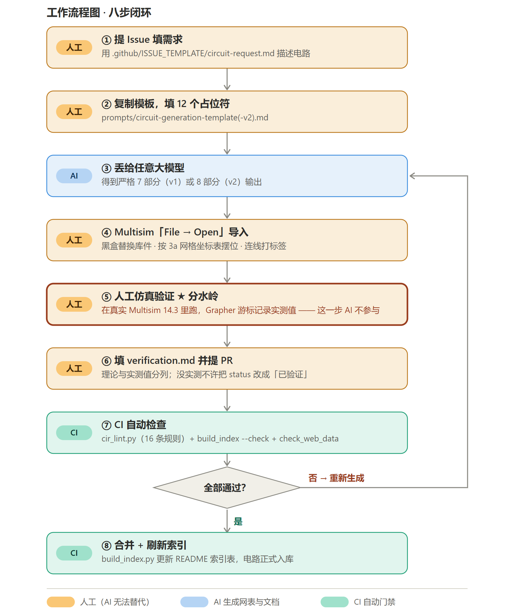
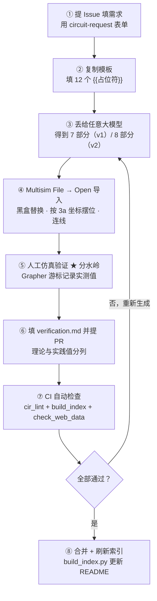

# multisim-ai-circuits

[](https://github.com/ZhangJie86889/multisim-ai-circuits/actions/workflows/lint.yml)
[](https://www.python.org/)
[](./LICENSE)

> **English intro.** `multisim-ai-circuits` is a *prompt-first, human-verified* circuit library for **NI Multisim 14.3**.
> Instead of digging through Multisim's deep **Group → Family → Component** tree for every lab exercise, you fill in
> one parameterized prompt, hand it to any LLM, and get back **seven structured deliverables**: a `.cir` netlist that
> opens directly with `File → Open`, a BOM with Multisim library paths, an ASCII layout, a wiring table, instrument
> settings, and a theory-vs-measurement checklist.
> The catch — and we are deliberately explicit about it — is that **AI writes the netlist, humans run the simulation**.
> Every circuit directory carries a verification badge, and nothing is promoted to `已验证` until a contributor has
> actually opened it in Multisim and recorded real Grapher readings.

---

## 一、项目定位与痛点

- **项目名**：multisim-ai-circuits
- **一句话**：用标准化提示词让 AI 生成可直接 `File → Open` 导入 Multisim 14.3 的 `.cir` 网表 + 配套文档，
  替代人工在 Multisim 库中逐层翻找元器件（Group → Family → Component）。
- **解决痛点**：Multisim 元件库层级深，找元件、定参数、查连线顺序、算验证值，
  初学者**每个电路要耗 1~2 小时**且极易接错（极性反、引脚反、偏置电阻算错、忘记接地）。

### 诚实边界（重要）

> ⚠️ **AI 负责生成网表与文档；Multisim 导入与仿真读数由贡献者人工验证。**
> 每个电路目录都带**验证状态标签**（🟢 已验证 / 🟡 待验证 / 🔴 验证失败），
> `verification.md` 中理论值与实测值分列。**本项目杜绝"AI 生成就当能用"。**
> 一个 `🟡 待验证` 的电路表示：网表通过语法 lint，但**还没有人在真实 Multisim 里跑通过**。

---

## 二、工作流程图

> 🔍 **嫌 GitHub 上看着小就点开图**（点图会打开矢量版 [`docs/images/workflow.svg`](./docs/images/workflow.svg)，
> 可无限放大）。图按 **人工 / AI / CI** 三类角色着色——第 ⑤ 步「人工仿真验证」是分水岭，任何人都替代不了。

[](./docs/images/workflow.svg)

<details>
<summary>展开可编辑的 Mermaid 源码（竖排 TD；原先是 <code>flowchart LR</code>，9 个节点横排会被 GitHub 缩到看不清）</summary>



</details>

**ASCII 版**（图完全渲染不出来时兜底用）：

```
 ① 提 Issue 填需求                                        [人工]
        |
        v
 ② 复制模板，填 12 个占位符                                [人工]
        |
        v
 ③ 丢给任意大模型  ──> 7 部分（v1）/ 8 部分（v2）输出        [AI]
        |
        v
 ④ Multisim「File → Open」导入                             [人工]
    黑盒替换库件 · 按 3a 网格坐标表摆位 · 连线打网络标签
        |
        v
 ⑤ 人工仿真验证 ★ 分水岭    <──── 这一步 AI 不参与          [人工]
    在真实 Multisim 14.3 里跑，Grapher 游标记录实测值
        |
        v
 ⑥ 填 verification.md 并提 PR                              [人工]
        |
        v
 ⑦ CI 自动检查（16 条规则 + 索引表 + web 数据同步）          [CI]
        |
        v
   全部通过？ ──否──> 回到 ③ 重新生成
        |
       是
        v
 ⑧ 合并 + build_index.py 刷新索引，电路正式入库             [CI]
```

---

## 三、Quick Start（三步）

### Step 1 · 复制模板

打开 [`prompts/circuit-generation-template.md`](./prompts/circuit-generation-template.md)，整段复制。

### Step 2 · 填占位符

把 `{{...}}` 全部替换掉（不知道怎么填就看 [`prompts/README.md`](./prompts/README.md) 的填写示例）。
最快的方式是去 `.github/ISSUE_TEMPLATE/circuit-request.md` 开一个 Issue，表单字段与占位符一一对应，
填完直接复制进模板。

### Step 3 · 丢给任意 AI

粘贴给任意大模型（DeepSeek / 通义 / GPT / Claude / 豆包均可），得到**严格 7 部分**输出：

| # | 部分 | 用途 |
|---|------|------|
| 1 | 完整 `.cir` 网表代码 | 存成 `xxx.cir`，`File → Open` 导入 |
| 2 | 元件清单表 | 网表标号 / Multisim 库路径 / 参数 |
| 3 | ASCII 布局图 | 导入后照着摆位、旋转 |
| 4 | 导入后整理步骤 | 黑盒替换 / 摆位 / 连线顺序 |
| 5 | 连线表 | 逐条核对，防漏线 |
| 6 | 仪器设置 | XFG1 / XSC1 端子与面板参数 + Grapher 游标读数法 |
| 7 | 验证值 + 易错点 | 理论计算表 + 3 个典型接错方式的读数表现 |

> 💡 落地建议：新建 `circuits/NNN-xxx/` 目录，直接 `cp -r circuits/_template/`，然后往里填。

### v1 还是 v2？

| | 模板 | 输出 | 适合 |
|---|------|------|------|
| **v1** | [`circuit-generation-template.md`](./prompts/circuit-generation-template.md) | 7 部分 | 现有 3 个种子电路用的就是它（`prompt-used.md` 可复现） |
| **v2** ⭐ | [`circuit-generation-template-v2.md`](./prompts/circuit-generation-template-v2.md) | 8 部分 | **元件多、连线复杂的电路**（共射放大、555、运放）；新增 3a 网格坐标表，导入后照表摆位 |

v2 新增 4 条硬约束：**网络标签优先**（节点名语义化，远距离元件取同名节点而不画长飞线）、
**信号流单调向右**（禁止回绕）、**扇出 ≤ 4**、**电源与地统一**；
并把第 3 部分拆成 **3a 网格坐标表（列 / 行 / 旋转）+ 3b ASCII 图**。

> ⚠️ 但要说清楚：`.cir` 网表**不含任何坐标信息**，v2 也**不能让 Multisim 自动摆整齐**。
> 它的真实收益是把「导入后整理」从 ~30 分钟压到 ~5 分钟。要零整理只能换带坐标的格式
> （LTspice `.asc` / EasyEDA JSON），详见 [`docs/faq.md`](./docs/faq.md) Q2。

---

## 四、电路索引表

> 本表由 `python scripts/build_index.py --write` 自动生成，**请不要手改**。
> 字段来源：各 `circuits/*/README.md` 顶部的 YAML front-matter。

<!-- CIRCUIT-INDEX:START -->
| 编号 | 电路名 | 难度 | 验证状态 | 一句话说明 |
|------|--------|------|----------|------------|
| 001 | [BJT 开关驱动 LED](circuits/001-bjt-switch-led/README.md) | 入门 | 🟡 待验证 | 2N2222 饱和开关驱动红色 LED，验证 Ib/Ic/Vce(sat) 与开关波形 |
| 002 | [共射极放大器](circuits/002-common-emitter-amp/README.md) | 入门 | 🟡 待验证 | 2N2222 分压偏置共射放大，阻容耦合，增益 ≥ 20，下限频率约 10 Hz |
| 003 | [NE555 多谐振荡器](circuits/003-555-astable/README.md) | 进阶 | 🟡 待验证 | NE555 无稳态方波输出，约 1 kHz，占空比约 53%，需黑盒替换为库件 LM555CN |
<!-- CIRCUIT-INDEX:END -->

**验证状态图例**：🟢 已验证（人工跑通并附实测值） · 🟡 待验证（lint 通过但未经人工仿真） · 🔴 验证失败（已知问题，见 verification.md）

---

## 五、目录说明

```
multisim-ai-circuits/
├── README.md                      # 本文件：定位 / 流程 / Quick Start / 索引
├── LICENSE                        # MIT
├── CONTRIBUTING.md                # 五步贡献流程 + PR 检查清单
├── prompts/                       # ★ 核心资产
│   ├── circuit-generation-template.md   # v1：参数化生成模板（7 部分输出）
│   ├── circuit-generation-template-v2.md # v2：强化导入布局（8 部分，多一张网格坐标表）
│   ├── circuit-review-prompt.md         # PR 前自检提示词（7 项 PASS/FAIL）
│   └── README.md                        # 占位符填写规范 + 示例
├── circuits/                      # 电路库，一个目录一个电路
│   ├── _template/                 # 新电路目录模板（复制即用）
│   │   ├── TEMPLATE.cir           # 网表骨架（含行序与注释规范）
│   │   ├── README.md              # 3a 网格坐标表 + 3b ASCII 图等 8 部分
│   │   ├── prompt-used.md         # 本次实际使用的提示词（可复现）
│   │   └── verification.md        # 理论值 / 实测值 / 状态标签
│   ├── 001-bjt-switch-led/
│   ├── 002-common-emitter-amp/
│   └── 003-555-astable/
├── docs/
│   ├── workflow.md                # 完整贡献流程图文
│   ├── multisim-library-map.md    # 常用元件库路径速查表
│   └── faq.md                     # 高频问题（导入失败 / 图乱 / 仪器设置…）
├── scripts/
│   ├── cir_lint.py                # .cir 硬约束自动检查（CI 用）
│   ├── build_index.py             # 扫描 circuits/ 自动生成索引表
│   └── check_web_data.py          # 校验 web 数据与 circuits/ 是否同步
├── web/                           # ★ 配套静态站点（Vite + React + TS）
│   ├── src/lib/cir-lint.ts        # cir_lint.py 的浏览器端移植（在线检查用）
│   ├── src/data/                  # 电路 / FAQ / 元件库 / 提示词模板（静态内嵌）
│   ├── src/components/            # 布局壳 / 代码块 / 状态徽章 / 原理图 SVG
│   └── src/routes/                # 首页 / 电路库 / 详情 / 生成器 / 检查 / 速查 / FAQ / 工作流
└── .github/
    ├── ISSUE_TEMPLATE/circuit-request.md   # 求电路表单（字段对应模板占位符）
    └── workflows/
        ├── lint.yml                          # CI：push/PR 跑 cir_lint
        └── pages.yml                         # CD：构建并发布 web/ 到 GitHub Pages
```

---

## 六、本地自检

```bash
# 检查单个网表
python scripts/cir_lint.py circuits/001-bjt-switch-led/001-bjt-switch-led.cir

# 批量检查整个 circuits/（目录模式）
python scripts/cir_lint.py circuits/

# 严格模式：warning 也算失败
python scripts/cir_lint.py circuits/ --strict

# 重新生成上方索引表并写回 README.md
python scripts/build_index.py --write

# CI 友好：只校验索引是否最新（不同步则退出码 1）
python scripts/build_index.py --check
```

`cir_lint` 的 16 条规则（9 error / 6 warn / 1 info）见 [`scripts/cir_lint.py`](./scripts/cir_lint.py) 文件头，CI 配置见
[`.github/workflows/lint.yml`](./.github/workflows/lint.yml)。

---

## 七、FAQ

常见问题（导入后分析指令被忽略、元件乱摆、XFG1 幅值与偏移、`.cir` 打不开、
floating node、LED 不亮、555 不振…）统一收录在 **[`docs/faq.md`](./docs/faq.md)**。

---

## 八、配套网页（web/）

不想装 Python、只想快速看电路或生成提示词？仓库自带一个纯静态站点：

| 页面 | 能做什么 |
|------|---------|
| 电路库 / 详情 | 浏览三个种子电路的完整网表、元件表、连线表、仪器设置、理论值 |
| 提示词生成器 | 填 12 个字段，实时拼出完整生成提示词，一键复制 |
| 在线检查 | 粘贴 `.cir`，浏览器内跑 16 条规则（`cir_lint.py` 的 TS 移植），逐条定位错误 |
| 元件库速查 | `Group / Family / Component` 三级路径，支持搜索 |
| FAQ / 工作流 | 12 条高频问答、八步贡献流程、PR 前 7 项自检 |

本地跑：

```bash
cd web
npm install
npm run dev        # http://localhost:5173
npm run build      # 类型检查 + 产出 web/dist
```

**不引入任何后端 / 数据库 / 鉴权**，数据全部静态内嵌，在线检查在浏览器本地执行。
详见 [`web/README.md`](./web/README.md)。

> ⚠️ `web/src/data/circuits.ts` 内嵌了 `.cir` 全文，与 `circuits/` 目录是两份拷贝。
> 改动其一后请跑 `python scripts/check_web_data.py -v` 校验同步（CI 也会跑）。

---

## 九、声明

> ### ⚠️ AI 生成内容需人工验证
>
> 1. 本仓库所有 `.cir` 网表与配套文档均由 AI 依据 [`prompts/`](./prompts) 生成，**未经人工仿真验证前一律标记为 🟡 待验证**。
> 2. AI 无法访问 Multisim 的元件主数据库，网表中的 `.MODEL` 参数、库路径、引脚顺序
>    **可能与 Multisim 14.3 实际库件不一致**，导入后必须做"黑盒替换"与逐线核对。
> 3. Multisim 的网表导入器对分析指令（`.OP/.TRAN/.AC`）支持不稳定，
>    **仿真设置请在 Multisim UI 里重新确认**（`Simulate → Analyses and simulation`）。
> 4. 只有 `verification.md` 中"实测值"列被真实 Grapher 读数填满、状态改为 🟢 的电路，
>    才可以作为教学/实验参考直接使用。
> 5. 因使用本仓库内容导致的实验误差、器件损坏或成绩问题，作者与贡献者不承担责任。
>
> **发现 AI 说错了？** 这正是我们要的 —— 请直接开 Issue 或提 PR 修正，并附上 Multisim 截图。
